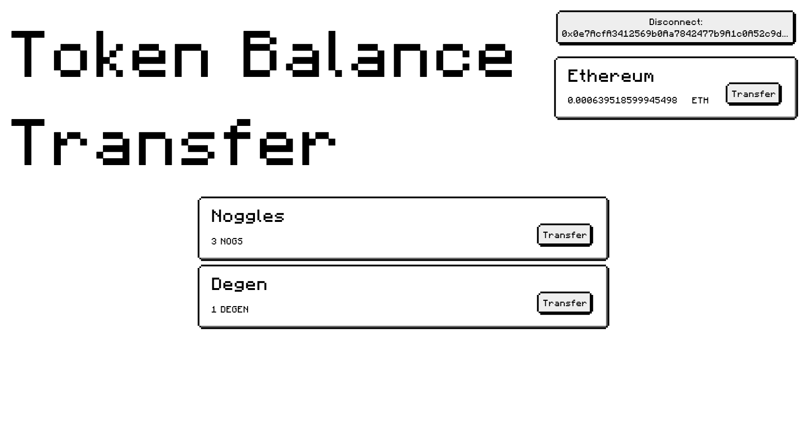

# Token Balance Transfer

Token Balance Transfer — это Web3-приложение, позволяющее пользователям подключить свой криптовалютный кошелек, просматривать баланс в Ethereum и список токенов стандарта ERC-20, хранящихся на их адресе. Кроме того, приложение позволяет переводить Ethereum и ERC-20 токены на другой кошелек.

---

Готовый проект доступен по адреесу [token-balance-transfer](https://token-balance-transfer.vercel.app/)

<p align="left">
 
</p>
---

## Используемые технологии

- **TypeScript** — статическая типизация для улучшения качества кода.
- **Vite** — быстрый и современный сборщик для фронтенд-приложений.
- **React** — популярная библиотека для создания пользовательских интерфейсов.
- **TanStack React Query** — библиотека для управления серверными данными.
- **Axios** — HTTP-клиент для отправки запросов к API.
- **dotenv** — работа с переменными окружения.
- **Wagmi** и **Viem** — библиотеки для взаимодействия с Web3 и блокчейном Ethereum.
- **Docker** — контейнеризация для упрощения развертывания и запуска проекта.
- **Chainbase API** — используем для получения списка ERC-20 токенов.
- **Retro UI** — используем для оформления интерфейса приложения.

---

## Возможности приложения

- Подключение Web3-кошелька.
- Просмотр баланса в нативном токене сети (ETH).
- Получение списка всех ERC-20 токенов на адресе пользователя.
- Перевод Ethereum и токенов ERC-20 на другой адрес.

---

## Установка и запуск проекта

### 1. Клонирование репозитория

```bash
git clone git@github.com:Tciganskybaron/token-balance-transfer.git
cd token-balance-transfer
```

### 2. Создание файла `.env`

Создайте файл `.env` в корне проекта с содержимым:

```bash
VITE_API_CHAINBASE_KEY="your_chainbase_api_key"
VITE_OPEN_DEVTOOLS="false | true" 
```

Замените `your_chainbase_api_key` на ваш ключ API от Chainbase.
VITE_OPEN_DEVTOOLS добавляет ReactQueryDevtools на страницу.

### 3. Установка зависимостей

Запустите следующую команду для установки всех необходимых зависимостей:

```bash
npm install
```

### 4. Локальный запуск проекта

Для запуска проекта в режиме разработки выполните команду:

```bash
npm run dev
```

После этого проект будет доступен по адресу [http://localhost:8080](http://localhost:8080).

### 5. Сборка проекта для продакшена

Чтобы собрать проект для продакшена, выполните команду:

```bash
npm run build
```

### 6. Запуск проекта в Docker

1. Соберите Docker-образ и запустите проект в контейнере:

   ```bash
   docker-compose up --build
   ```

2. После успешной сборки проект будет доступен по адресу [http://localhost:3000](http://localhost:3000).

---

## Благодарности

Особая благодарность[Retro UI](https://www.retroui.io/). за предоставление визуальных компонентов, которые помогли создать стильный и функциональный пользовательский интерфейс нашего приложения.

---
